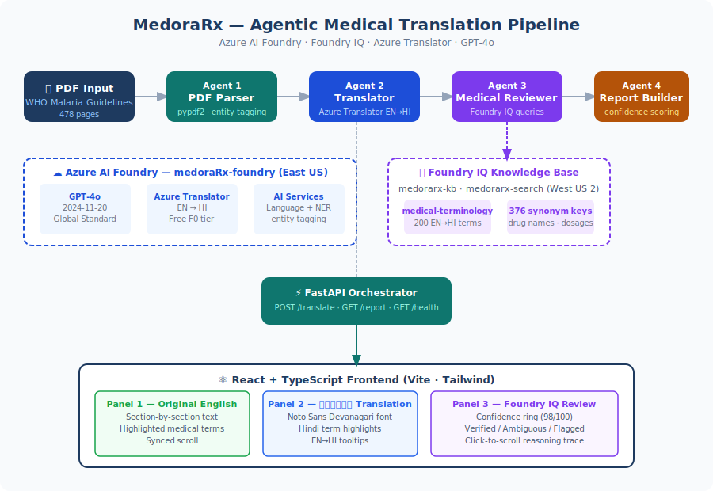
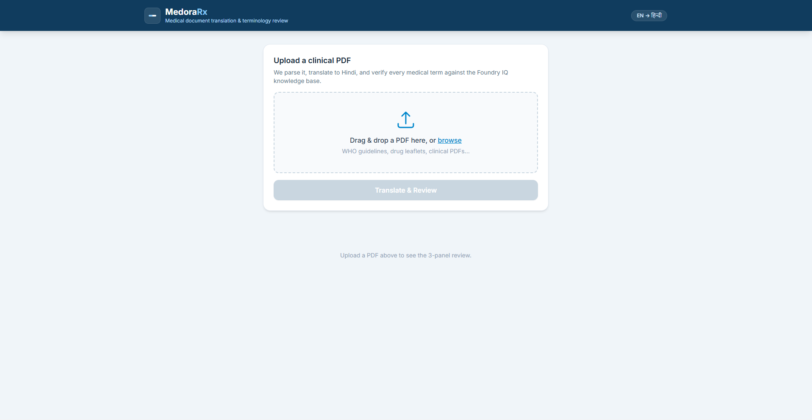
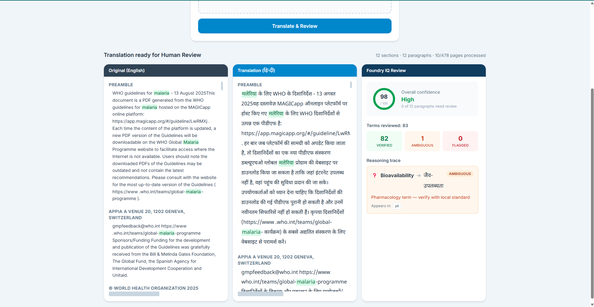
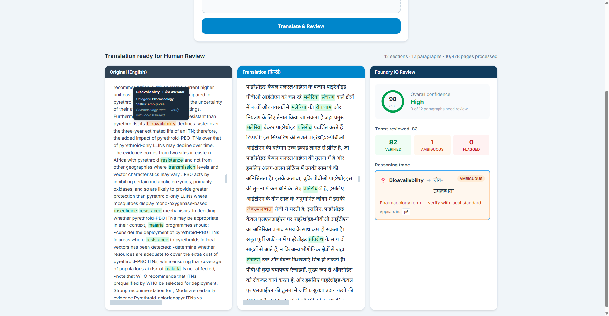

# MedoraRx 🏥

> **Translating medical knowledge into every language, one life at a time.**

[](https://ai.azure.com)
[](https://aka.ms/iq-series)
[](https://aka.ms/agentsleague)
[](LICENSE)

---

## 🌍 The Problem

**600 million Hindi speakers have almost no access to WHO-grade medical guidelines in their language.**

When a community health worker in rural India needs to understand antimalarial drug dosages, treatment protocols, or disease prevention guidelines — they face a wall of dense English medical text. Mistranslations in medical literature are not just inconvenient. They can be fatal.

MedoraRx was inspired by a real ongoing project: translating a medical literacy book for a nonprofit community health initiative in India. The challenge wasn't just translation — it was *validated* translation. Medical terms like drug names, dosage units, and clinical terminology require verification, not just word-for-word conversion.

---

## 💡 What is MedoraRx?

MedoraRx is an **agentic AI pipeline** built on **Microsoft Azure AI Foundry** that:

1. Ingests any medical PDF document
2. Translates it from English to Hindi using Azure Translator
3. Validates every medical term against a **Foundry IQ** knowledge base
4. Flags ambiguous terms, drug names, and dosage units for human review
5. Presents a side-by-side reviewed translation with confidence scores

The result: a **human-reviewable, medically validated Hindi translation** — not just a raw machine translation.

---

## 🏗️ Architecture



---

## 📸 Screenshots





---

## 🔑 Microsoft IQ Integration

MedoraRx uses **Foundry IQ** as its core intelligence layer:

| Component | Role |
|---|---|
| **Foundry IQ Knowledge Base** | Indexes medical terminology with Hindi translations |
| **Agentic Retrieval** | Agent 3 queries KB for every medical term found in translation |
| **Confidence Scoring** | Each term returned with `high / medium / low` confidence |
| **Reasoning Trace** | UI shows *why* each term was flagged — not just *that* it was flagged |

This is not a superficial integration — Foundry IQ is the reason MedoraRx produces *validated* translations rather than raw machine output.

---

## 🤖 Agent Pipeline Detail

### Agent 1 — PDF Parser
- Extracts text from medical PDF preserving structure
- Tags sections: headings, paragraphs, tables, footnotes
- Uses `pypdf2` for extraction and Azure AI Language for entity recognition
- Output: structured JSON with sections and medical entity candidates

### Agent 2 — Translator
- Calls Azure Translator API (English → Hindi)
- Uses few-shot style guidance for medical context consistency
- Preserves document structure through translation
- Output: translated JSON matching input structure

### Agent 3 — Medical Reviewer *(Foundry IQ)*
- For every medical term identified by Agent 1, queries Foundry IQ
- Validates translated term against knowledge base
- Tags each term: `✅ Verified` / `⚠️ Ambiguous` / `❌ No equivalent found`
- Returns reasoning: *"Drug name — verify transliteration with local pharmacopeia"*
- Output: review JSON with confidence scores and flag reasons

### Agent 4 — Report Builder
- Assembles final output combining translation + review results
- Calculates paragraph-level confidence scores
- Identifies sections requiring urgent human review
- Output: final review-ready JSON for frontend rendering

---

## 🛠️ Tech Stack

| Layer | Technology |
|---|---|
| **Agent Orchestration** | Azure AI Foundry Agent Service |
| **IQ Layer** | Microsoft Foundry IQ (Azure AI Search — Basic) |
| **Translation** | Azure Translator (included in AI Foundry resource) |
| **LLM** | GPT-4o (deployed via Azure AI Foundry) |
| **Backend** | Python 3.14, FastAPI |
| **Frontend** | React 18, TypeScript |
| **PDF Processing** | pypdf2 |
| **Dev Tools** | GitHub Copilot, Claude Code |

---

## 🌐 Azure Resources

| Resource | Name | Region |
|---|---|---|
| Resource Group | MedoraRx-rg | East US |
| AI Foundry | medoraRx-foundry | East US |
| Foundry Project | MedoraRx-project | East US |
| GPT-4o Deployment | gpt-4o (2024-11-20) | Global Standard |
| Foundry IQ Search | medorarx-search | West US 2 |
| Knowledge Base | medorarx-kb | — |

---

## 🚀 Getting Started

### Prerequisites
- Python 3.10+
- Node.js 18+
- Azure subscription with AI Foundry access
- Azure AI Foundry project with GPT-4o deployed
- Foundry IQ knowledge base configured

## ⚡ Quick Start

1. Clone the repo
2. Copy `backend/.env.example` to `backend/.env` and fill in Azure credentials
3. `pip install -r backend/requirements.txt`
4. `uvicorn backend.main:app --reload --port 8000`
5. `cd frontend && npm install && npm run dev`
6. Open http://localhost:5173 and upload a medical PDF

---

## 🔄 How It Works

1. Upload any medical PDF
2. Agent 1 extracts and structures the text
3. Agent 2 translates to Hindi via Azure Translator
4. Agent 3 validates every medical term against Foundry IQ knowledge base
5. Agent 4 builds a confidence-scored review report
6. Review the results in the 3-panel viewer

An **Orchestrator** (FastAPI backend) manages all 4 agents in sequence, passing structured output from one agent as input to the next, ensuring data consistency and error handling throughout the pipeline.

---

## 📁 Project Structure

```
MedoraRx/
├── README.md
├── .gitignore
├── backend/
│   ├── main.py                        ← FastAPI orchestrator
│   ├── requirements.txt
│   ├── .env.example
│   ├── agents/
│   │   ├── parser_agent.py            ← Agent 1: PDF Parser
│   │   ├── translator_agent.py        ← Agent 2: Translator
│   │   ├── reviewer_agent.py          ← Agent 3: Medical Reviewer
│   │   └── report_builder.py          ← Agent 4: Report Builder
│   ├── foundry_iq/
│   │   └── setup_knowledge_base.py    ← KB indexing script
│   └── tests/
│       ├── test_openai.py
│       └── test_translator.py
├── frontend/
│   └── src/
│       ├── App.tsx
│       └── components/
│           ├── PDFUploader.tsx
│           ├── TranslationViewer.tsx  ← 3-panel side-by-side viewer
│           └── FlaggedTerms.tsx
└── data/
    ├── medical_glossary.json          ← 200 medical terms EN→HI
    └── sample/
        └── who_malaria_guidelines_2025.pdf
```

---

## 🎯 Demo

> Demo video: Coming soon

**Demo input:** WHO Guidelines for Malaria (August 2025, 478 pages)

**Demo output:**
- Pages processed: 10 of 478
- Sections found: 12
- Terms reviewed: 83
- Verified: 82
- Ambiguous: 1 (Bioavailability)
- Overall confidence: 98/100

---

## 🌱 Real-World Impact

MedoraRx was inspired by an active nonprofit initiative translating medical literacy books for underserved communities in India. The demo uses WHO's publicly licensed Malaria Guidelines (CC BY-NC-SA 3.0 IGO). The pipeline is language-agnostic and can be extended to any target language supported by Azure Translator.

**Potential reach:**
- 616M+ Hindi speakers
- 242M+ Bengali speakers
- 104M+ Telugu speakers
- 99M+ Marathi speakers
- Any language in Azure Translator's 100+ supported languages

---

## 📜 License

MIT License — see [LICENSE](LICENSE) for details.

Demo data: WHO Guidelines for Malaria © World Health Organization, licensed under CC BY-NC-SA 3.0 IGO.
